# aws-developer
- AWS Certified Developer AKA DVA-C01

- There is over 286 AWS services.

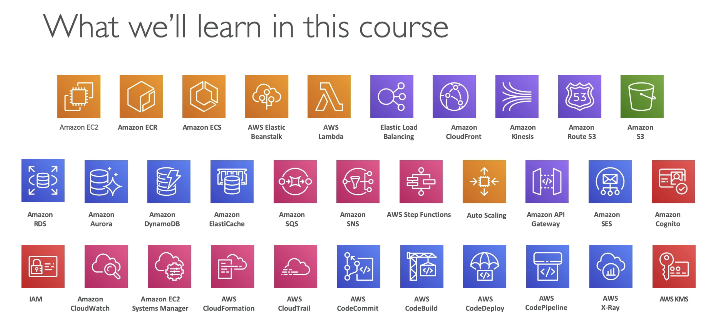

## 1- AWS Global Infrastructure :
    
    - aws regions
    - aws availibility zones
    - aws data centers
    - aws edge locations/point of presence

    this is a cool websites that shows availibility of cloud providers world wide. 
    https://www.cloudinfrastructuremap.com/
    
    % Question 1: How to choose a region ?
    
    + Complience : sometimes we have data governance constraints to not allow data to be 
                    stored outside of a region (e.g : France Bank data doesn't have permission to be stored in USA)
    + Services Availabilty : Not all aws services are available in all regions.
    + Latency : The closest the data center the lower is the latency.
    + Pricing : Pricing differ from region to region.

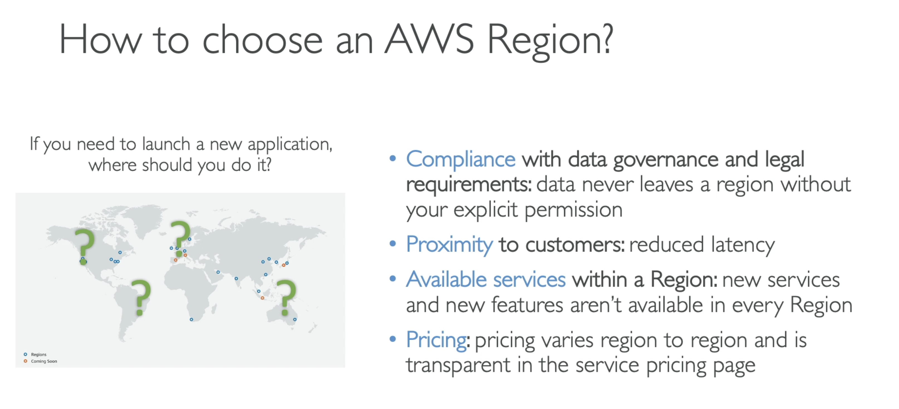

    % Availablity Zones :
    - Evry Region have multiple availability zones (min: 2, max: 6)
    - They are seperated, isoleted from disaster.
    - They are connected, with high bandwidth, and ultra-low latency.

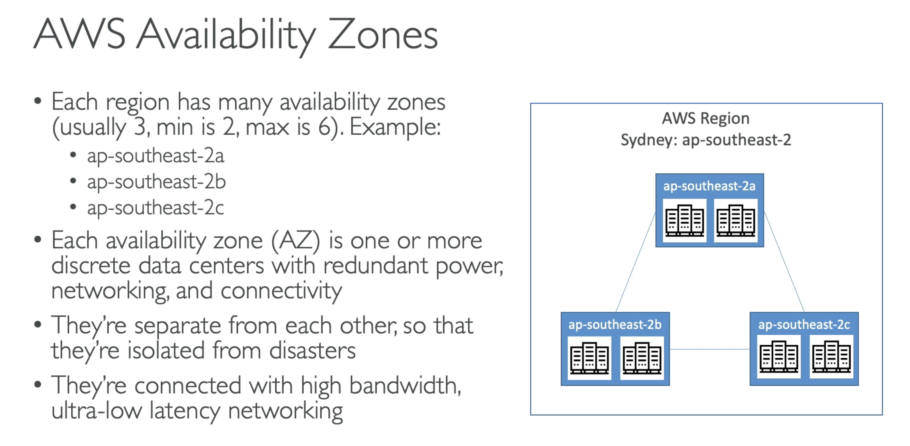
    
    + NB: you can check aws services availibilty by region thought this website :
    https://aws.amazon.com/fr/about-aws/global-infrastructure/regional-product-services/

    - Scopes of AWS services :
    + Amazon EC2 (Infrastucture as a service)
    + Amazon Elastic beanstalk (Platform as a service)
    + Amazon Lambda (Function as a service)
    + Amazon rekognition (Software as a service)

### 2- Amazon IAM Identity & Access Management (Users, Groups, Policies):
    - First IAM service doesn't require a region selection, it's a global service.
      ( e.g EC2 is a regional service )

    1- The root user of the account should not be used or shared by different teams instead we should create 
        other users (IAM users) assigned to groups, and have limited privileges thought different services.
    2- there is policies that define each user how many permissions he have.

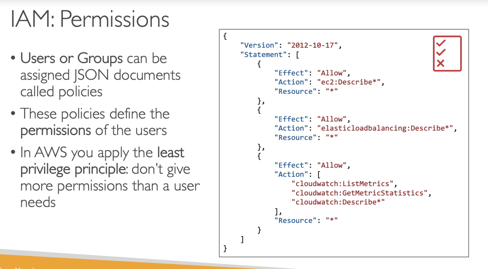
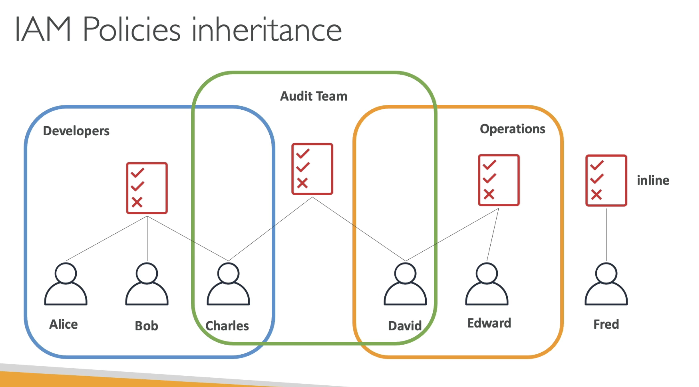
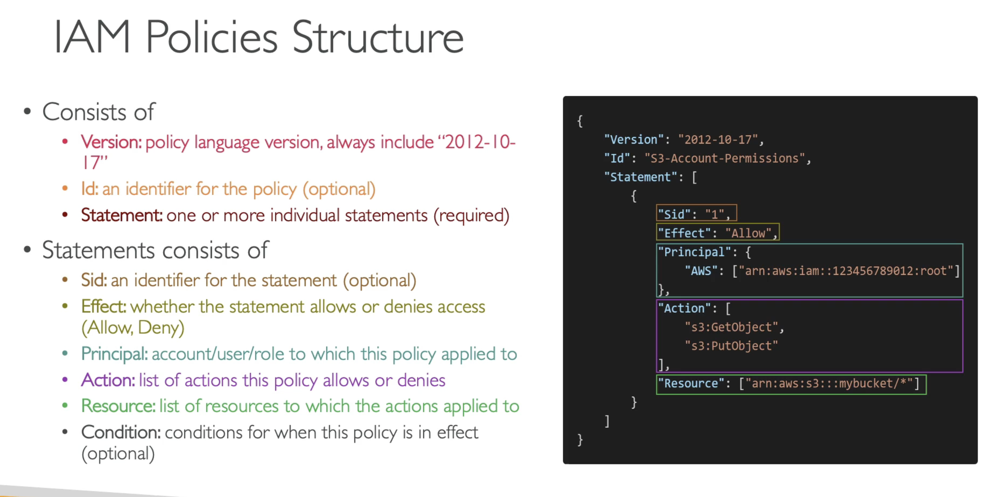
    
    NB: you can create your own policies thought Visual Editor you choose effects, resources and you are done.
    
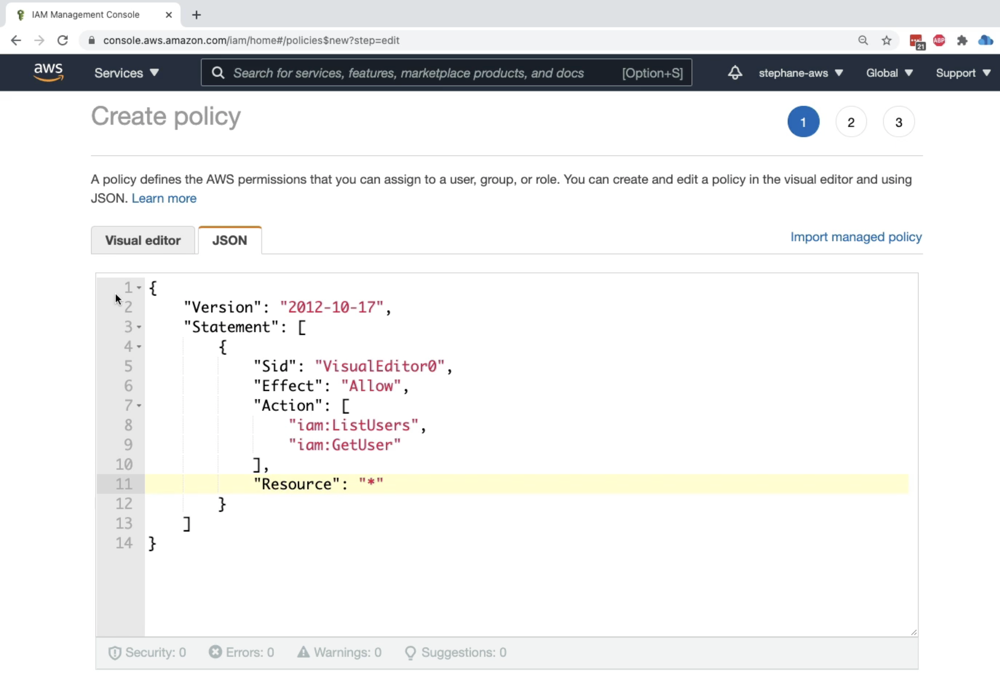

    2-1 IAM MFA - Multi Factor Authentication :
    MFA = your password + a device you own

    - Main benefits of MFA :
    + Even your password is hacked or stolen no one could login to your account 
      cuz it's protected by that device that you own.
    
### - There is too many options to use MFA with IAM users :    

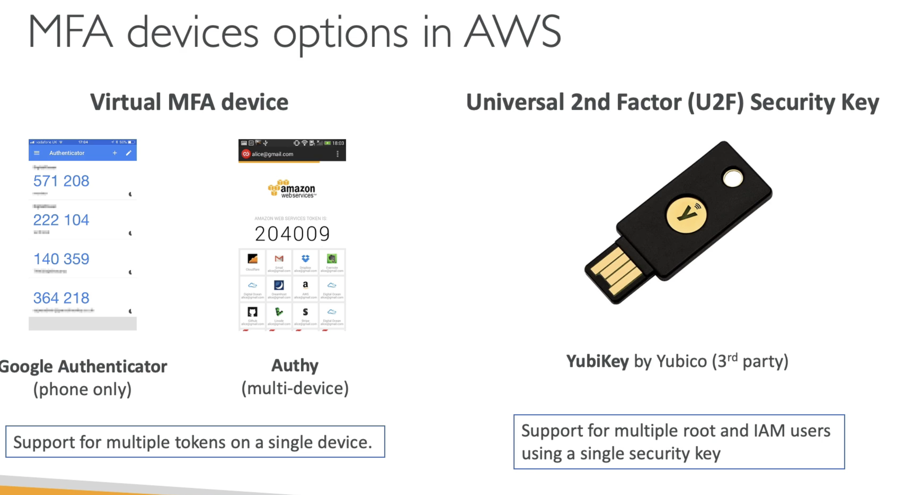

    2-1-1 Hands-on to setup MFA for a given user :

    1- go to security credentials.
    2- Click on Assigned MFA
    3- Select Virtual MFA
    4- Check the list of mobile apps compatible with aws accounts.
    (I prefer using Authy cuz it's multi-device)
    5- Click on generate QR code.
    6- Scan the qr code from your device.
    7- you will get multiple tokens that will expire in 30 seconds 
       entre two of them to validate connectivity between Authy and AWS Account.
    8- sign-out and sign-in to make sure its working

    Congrats you re done.
    
    3- AWS CLI (Command line interface) :

    3-1 How users could access AWS console ? :

    + basicaly we use access_key generated from aws console management to access aws from command-line.
    - here is the steps that we should follow to make AWS CLI ready to use :
    1- install aws cli 
    2- go to IAM -> users -> security credentials -> dowload access key
    3- go to your cli and run $ aws configure
    4- Copy/Paste credentials.
    5- to make sure you entred valid credentials 
    run $ aws iam list-users (to get all users in this account)
    
    + Result :

    {
        "Users": [
            {
                "Path": "/",
                "UserName": "mdrahali",
                "UserId": "AIDAWQGDRKKVKHBCZNJOJ",
                "Arn": "arn:aws:iam::447086678698:user/mdrahali",
                "CreateDate": "2022-02-01T09:24:55+00:00",
                "PasswordLastUsed": "2022-02-01T13:40:27+00:00"
        }
    
    3-2 IAM Roles :
    
    - IAM Roles alike Groups policies for AWS Users, Roles are related to AWS Services, for example we have an EC2 instance 
      that needs to perform certain actions on aws services we need to create a role for it just to make sure it have the required permission for.

    + Common Roles : 
    1- EC2 Instance roles
    2- Lambda function roles
    3- Roles for CloudFormation

### 3- EC2 Fundamentals :

    - EC2 is the virtual server used in aws cloud provider.

    + Setup Budget Limit :
    - before we start using this service we should setup a budget notification setting to notify in case we bypassed 
      the fixed budget limit.

    1- Go to root Account -> go to `Account` and search for `IAM User and Role Access to Billing Information` activate it for IAM users, 
    2- Sign-out and login to your IAM user, go to `Billing Dashboard`.
    3- Go to budget -> create a budget
    4- choose `cost budget` -> click on next
    5- budget limit settings :
       5-1 Period : Monthly
       5-2 Recurring Budget
       5-3 Fixed
       5-4 budget : 10$
       5-5 Budget Name : Learning Cost
       5-6 click on next -> add an `Alert Threshold` (e.g When i consumed 80% of the budget send me am alert)
           5-6-1 Alert #1 : 80% of actual budget + Your Email.
           5-6-2 Alert #2 : 60% of forcasted budget + Your Email.

       5-7 Finally click on `create budget`.

    3-1 EC2 sizing & Configurations :
    
    - How much compute power that you need (CPU Cores) 
    - How much RAM 
    - How much storage space : NETWORK ATTACHED EBS, EFS | Hardware Disk Capacity EC2.
    - Network Card and IP Address
    - Firewall Rules : Security Group
    - Boostrap Script (Script Excuted at the first launch) : EC2 user data

    + EC2 User Data :
    - is a script ran when it the first launch of ec2 instance.
    - CAUTION : the script is launched using root user so every command should require `SUDO` in the beginning.

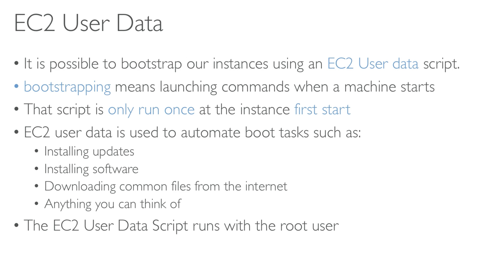

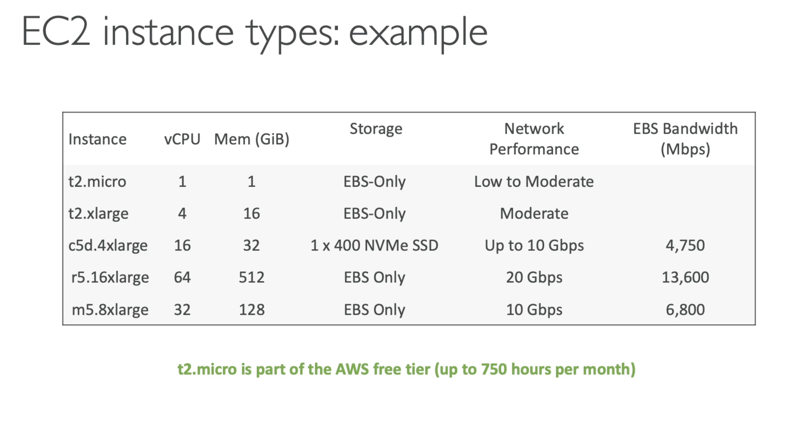 

    3-2 Create your first ec2 instance :
    
    1- go to ec2 -> click on `launch instance`
    2- choose your Image For Virtual Machine (e.g RedHat)
    3- choose your instance config.
    4- next go to user data at the bottom paste this script :
    
    """
        #!/bin/bash
        # Use this for your user data (script from top to bottom)
        # install httpd (Linux 2 version)
        yum update -y
        yum install -y httpd
        systemctl start httpd
        systemctl enable httpd
        echo "<h1>Hello World from $(hostname -f)</h1>" > /var/www/html/index.html
    """
    
    5- next add security group (as shown in security group config we have only tcp configured so we should 
        add http) :
       5-1 add http with port 80 and 0.0.0.0/0 to make sure it's available thought all IPs.
    6- then click on launch and create a key pair that will allow you to connect to your aws instance securely.
    NB: you should protect the key pair download cuz you cannot download it again.

    7- to make sure that your instance has been launched succesfuly and boot was done correctly 
       go to instance infos search for `Public IPv4 address` copy it and paste it in another tab.

    
    IMPORTANT: if you click directly on open address it use https which is not configured yet in our instance so it won't work this is why you should
        use http://IPV4 to check for result.
    
    - EC2 Instance Types for different use cases :
    + General Purposes
    + Compute Optimized
    + Memory Optimized
    + Accelerated Computing
    + Storage Optimized
    + Instance Features
    + Measuring Instance Performance
        
    - Naming Conventions Of Instance Types :
    e.g m5.2xlarge
        + m is for instance type (General Purposes)
        + 5 is for generation of hardware
        + 2.xlarge is for size of instance (Include CPU, RAM etc)   

    + General purposes instances :
    - they have a great diversity of workloads.
    - Balance between :
      * Compute
      * Memory
      * Networking

    + Compute Optimized :
    - Great for computer-intensive task that require high-performance processors.
    - use cases e.g -> Batch processing workloads, Media Transcoding, High Performance Computing, High Performance Servers, 
                       Scientific Modeling & Machine learning, Dedicated Gaming Servers. 
    
    + Memory Optimized :
    - Fast performance for workloads that process large datasets in memory (RAM).
    - use cases e.g -> High Perfomance Relational/Non-Relational databases, destributed web scale cache stores,
                       In-memory databases optimized for BI, Applications performing real-time processing of big unstructured data.

    + Storage Optimized :
    - Great for storage intensive tasks that require high, sequential read/write access to large datasets on localstorage.
    - use cases e.g -> High Frequency online transaction (OLTP), Relational/NoSQL databases, cache for in-memory databases (e.g Redis), 
                       datawarehousing applications, Distributed File Systems.

    !IMPORTANT : there is a website that show the comparaison between different instance types in aws :
                 https://instances.vantage.sh/

    3-2 Security Groups :
    + They are controlling traffic into and out of our instance.
    
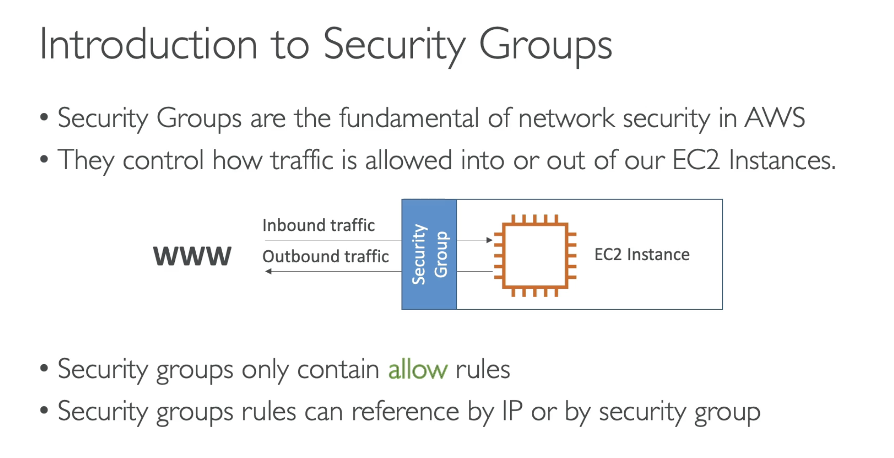
    
    + security groups are acting like firewalls to ec2 instance.
    + allowing access to certains ports.

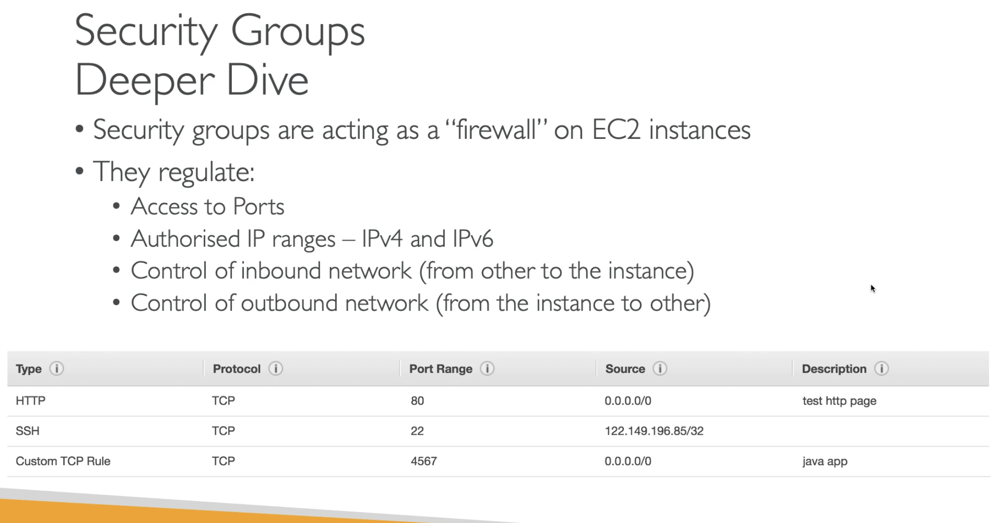

    NB: IP ADDRESS Range if you use 0.0.0.0/0 for http protocol that mean any ip address could access to our instance.
    0.0.0.0/0 for IPV4
    ::/0 for IPV6

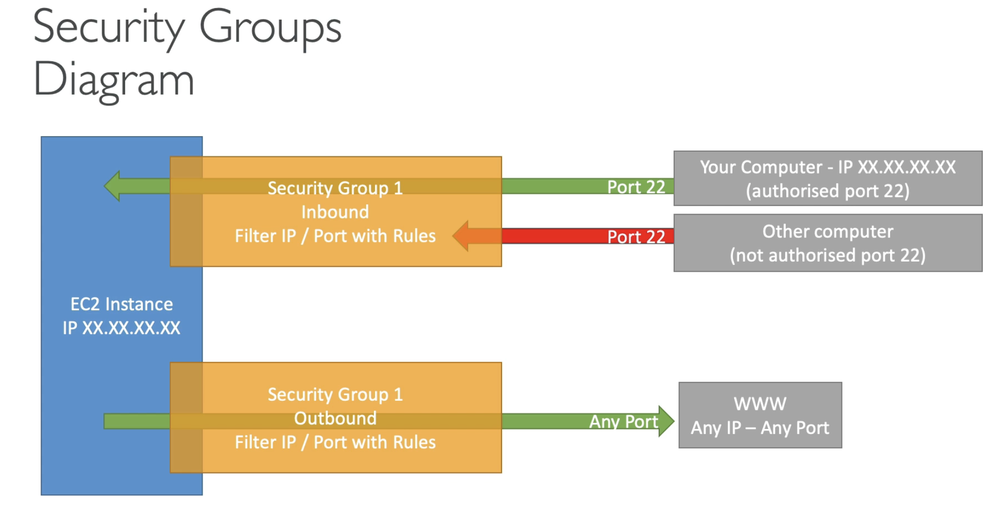
    
    + to elaborate diagram of security groups idea :
    ++ basicaly if defined a fixed ip address for inbound traffic you will have to access your instance only from this address (e.g your computer ip)
      but if you define it as 0.0.0.0/0 that mean anyt ip address could access it.

    - Security groups infos :
    1- security group is locked down to a combination of vpc/region.
    2- it's good to maintain one separate security group for ssh.
    3- if your application is not accessable (timeout) it's a security group issue
       and if it's connection refused message it's an application issue.
    4- All inbound traffic is blocked by default.
    5- All outbound traffic is authorized by default.
    
    IMPORTANT: 
    + Security groups could be attached to multiple instances.    
    + Also Instances could access each other if they have the same security group attached.
    
#### + Example Diagram :

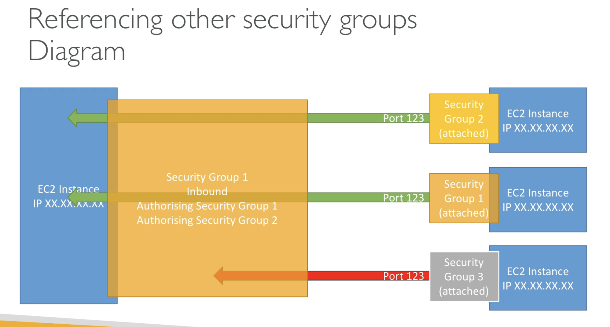
  
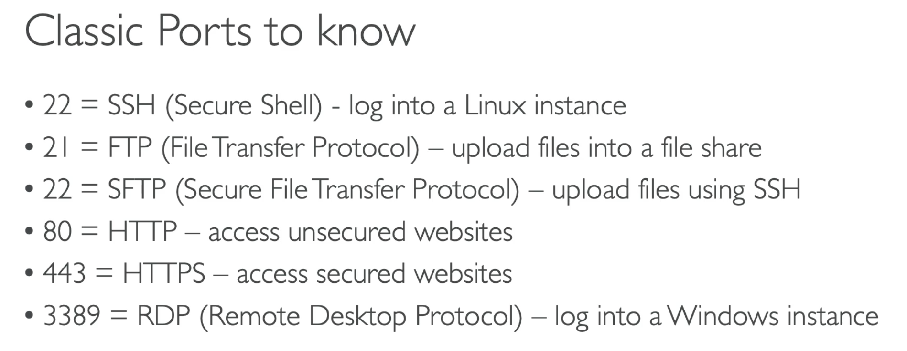

    
    3-3 SSH Connect to instance :
    
    - SSH is a protocol that allows to access/Control a machine remotly.
      and it work at port 22 (Inbound).
    
    + To access EC2 instance from your computer :

    - if you run the command below directly you will get this error message `Permissions 0644 for 'ec2-keys.pem' are too open`.
    $ ssh -i ec2-key.pem ec2-user@IPV4-PUBLIC-ADDRESS 
    
    - Instead :
    $ chmod 0400 ec2-keys.pem (Allows the owner to read)
    $ ssh -i ec2-key.pem ec2-user@IPV4-PUBLIC-ADDRESS 
    
    - SSH Troubleshooting :
    + I connected yesterday to ec2 instance but i cannot today :
    + This is probably because you have stopped your EC2 instance and then started it again today. When you do so, the public IP of your EC2 instance will change. Therefore, in your command, or Putty configuration, please make sure to edit and save the new public IP.
    
    ++ Also if you wanna check args related to your instance (SSH Client) select your instance and click connect.
    
    - EC2 Instance IAM Role :
    + We will explain thought next commands how to assign IAM Roles and give ec2 instance certains permissions
    $ aws iam list-users
    Unable to locate credentials. You can configure credentials by running "aws configure".
    NB: if we use `aws configure` and give our access key it s a dangerous step that will make anyone that have access to this instance to get this credentials. 
    
    - Instead we should assign an iam role to our instance :
    1- select `instance` and click on `actions` and choose `security` -> `Modify Role`
    2- create a role that have `IAMReadOnlyAccess` Permission -> save it as `DemoEC2`.
    3- get back to ec2 choose your instance click on `actions` and choose `security` -> `Modify Role`
    4- choose `DemoEC2` role and save it.

    5- run $ aws iam list-users (thought ssh client from your computer)
        {
            "Users": [
                {
                    "UserName": "mdrahali", 
                    "PasswordLastUsed": "2022-02-03T12:37:49Z", 
                    "CreateDate": "2022-02-01T09:24:55Z", 
                    "UserId": "AIDAWQGDRKKVKHBCZNJOJ", 
                    "Path": "/", 
                    "Arn": "arn:aws:iam::447086678698:user/mdrahali"
                }
            ]
        }

    3-4 Before choosing an EC2 instance to optimize charges you know the periode of using this instance like
        that you economize money :

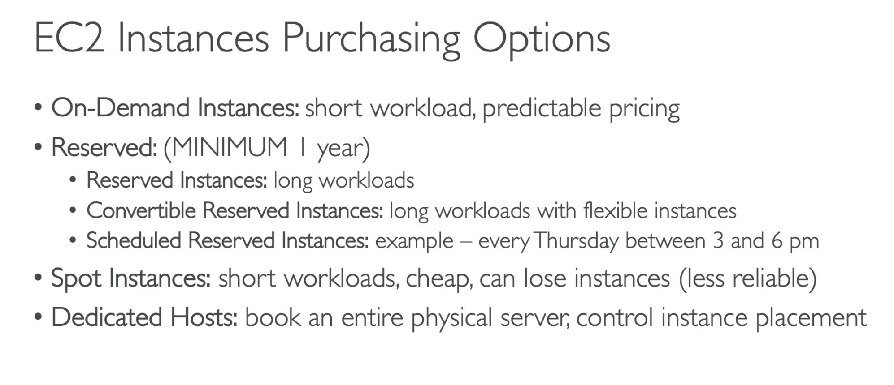        
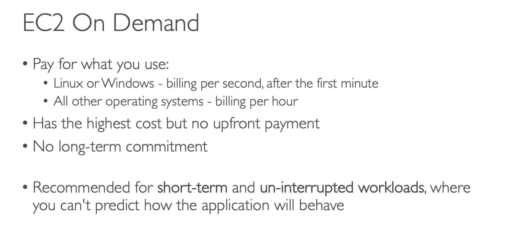
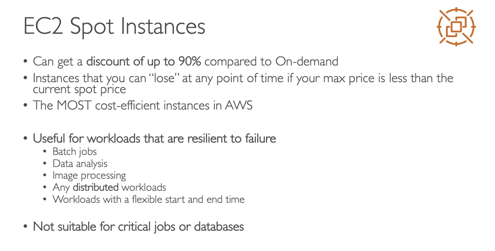
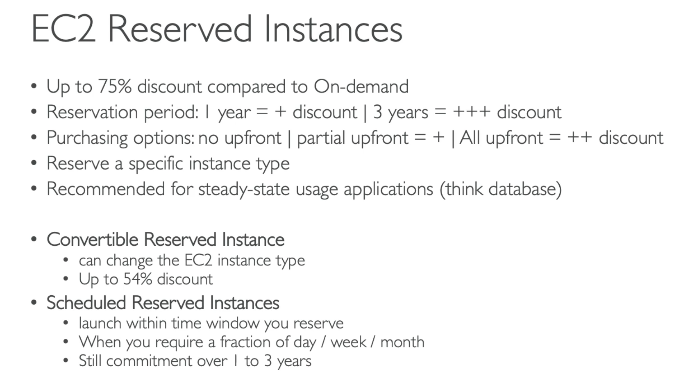 
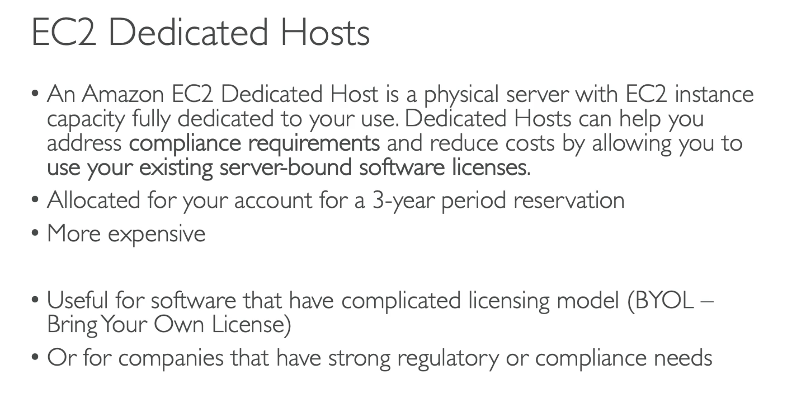
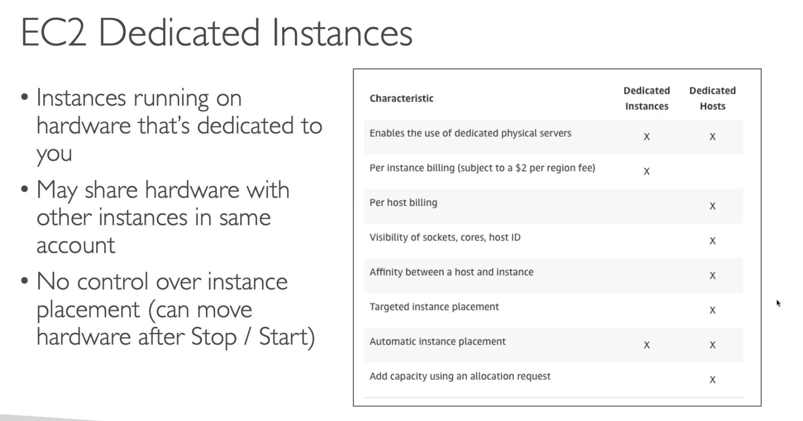
 
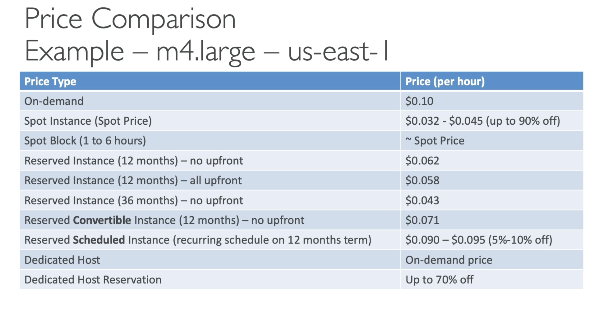 
    

### 4- Amazon EBS - Elastic Block Storage :

    - an EBS volume is a network drive that you can attach to your instance,
      while they run.
    - it allows your instance to persist data even after termination. (IMPORTANT: we can enable deleting or preserving EBS volume on termination)
    - This volume could be attached to multiple ec2 instances at the same time at a condition that they should be in the same Availibility Zone.
    - They are bound to a specific availibility zone. 
    
    IMPORTANT: That mean EBS in us-east-1 cannot be attached to us-east-2, but there is an alternative to move volumes
    to different availibility zones is to take a snapshots of the volume.

    - EBS have provisioned capacity (size in GB, IOPS) :
    + You get billed on provisioned capacity.
    + you can increase over time this capacity.
        
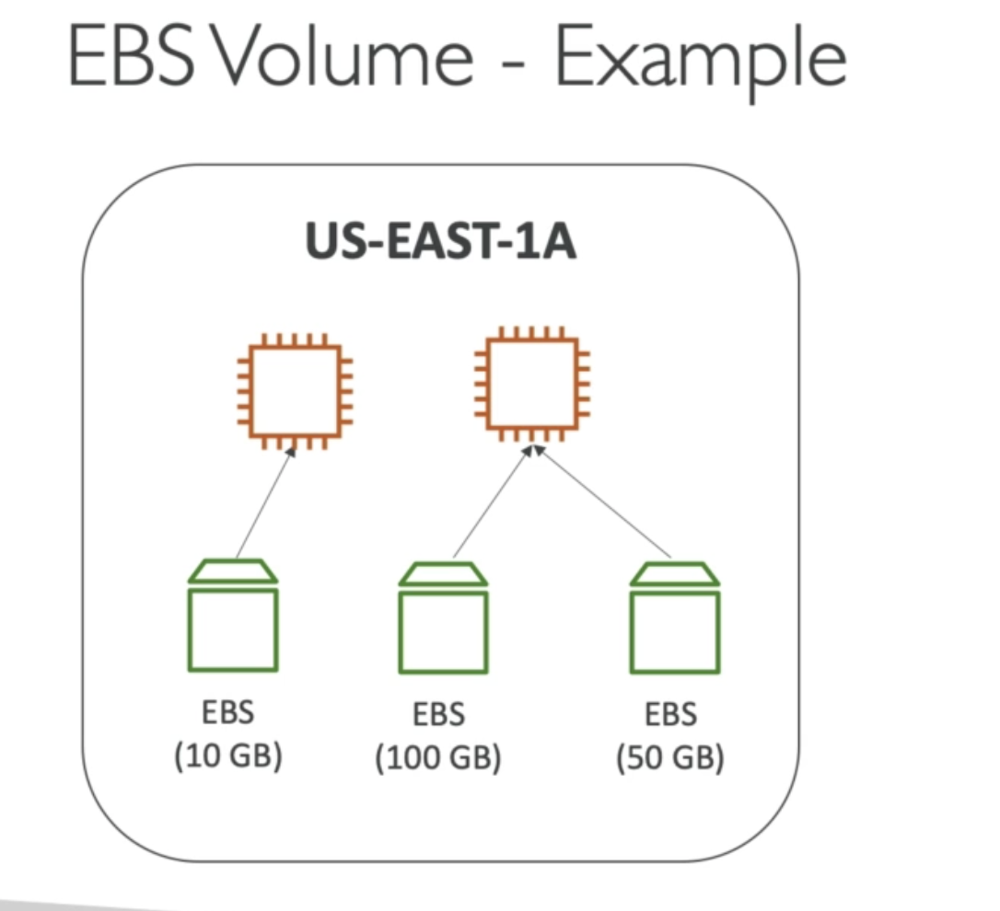    

    4-1 Create An EBS Snapshot for Backup at any given point of time :
    
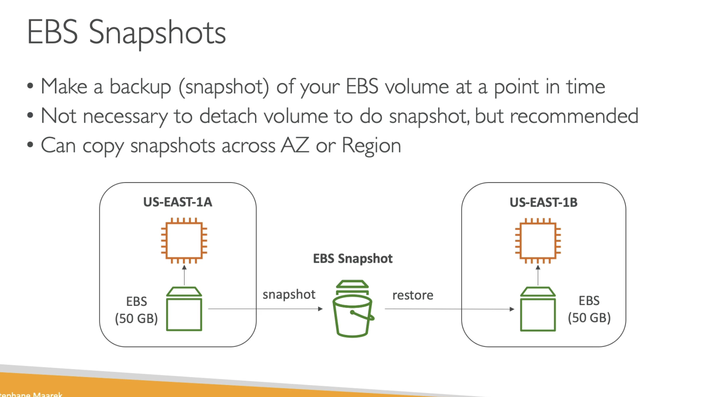
    
    4-1-1 Tutorial How to create a volume and attach it to an instance :    
    1- go to volumes, create that volume
    2- wait until we have running status on the volume then click right on this volume -> click on `attach volume` choose instance.
    
    NB: volume and instance should be in the same availibilty zone.

    4-1-2 Tutorial How to move a volume from us-east-2 to us-east-1 using snapshot (BackUp) technique :
    
    1- go to volumes click right on volume that you want to move to other AZ.
    2- click on `create a snapshot` then go to `snapshots` and click right on snapshot of this volume.
    3- click on `copy snapshot` -> choose `us-east-1` as an availibility zone.
    4- go to `us-east-1` you will find your snapshot (copied from us-east-2) -> select the snapshot then click right and click on create volume from snapshot.

    Done!
    
### 5 - Amazon AMI | Amazon Machine Image :

    - AMI is a pre-packaging OS, Tools that you will use as dependecies inside your instance.
    IMPORTANT : we can create an AMI from a launched EC2 (e.g we launched an ec2 instance based 
                on public ami and we added some depencies and we want to have the same AMI for another instance.)

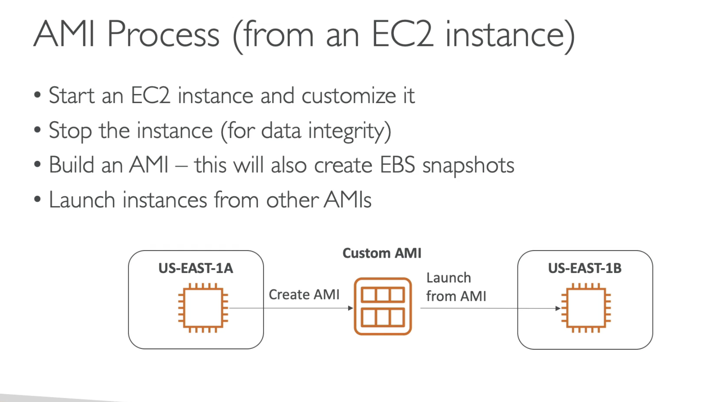

    - Tutorial - Creating AMI from EC2 instance :

    1- launch an instance (Default Setup)
    2- For EC2 User data script -> add apache installation only :
        #!/bin/bash
        # Use this for your user data (script from top to bottom)
        # install httpd (Linux 2 version)
        yum update -y
        yum install -y httpd
        systemctl start httpd
        systemctl enable httpd
    3- next click right on ec2 instance -> go to image and template -> click on create ami from ec2 instance.
    4- go to `instances` -> click on `launch an instance` -> go to `my AMI` choose the AMI created recently -> default setup for EC2 instance.
    5- for EC2 user data script (Second EC2 instance based on AMI) add >>
        echo "<h1>Hello World from $(hostname -f)</h1>" > /var/www/html/index.html

    6- when accessing differents EC2 instances : 
        + first one should show only apache starter page
        + Second one should show something like this `Hello World from ip-172-31-26-105.us-east-2.compute.internal`

    